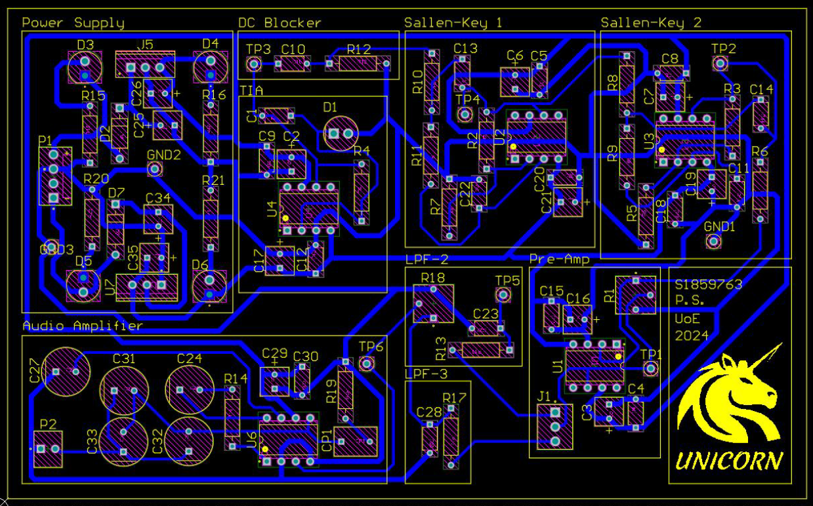
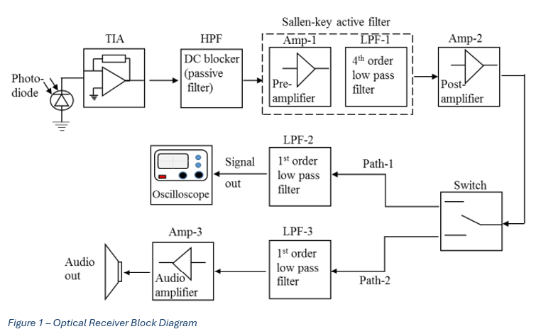

# Optical Receiver Design 
The optical receiver is designed with two signal paths: one for oscilloscope monitoring and debugging, and one for audio output. The design balances bandwidth, gain, loading, noise filtering, DC offset removal, and testability. Gain is distributed across multiple stages to maintain bandwidth and reduce distortion while buffering and appropriate stage impedance ratios are used to minimize loading effects.

## Layout Characteristics
The receiver is divided into two signal paths:
- Path 1: Scope/debugging output
- Path 2: Audio output

## Design Variables Considered
The design takes into account the following trade-offs and constraints:
- Bandwidth versus signal magnitude
- Loading effect versus signal magnitude
- Signal damping versus gain
- Filtering of coupled noise using passive filters and the properties of IC packages
- Bidirectional power supply requirements
- Signal level shifting
- DfX considerations, especially design for testing

## Mitigation Techniques
The following techniques are used to improve signal quality, stability, and testability:
- Buffering to reduce loading effects 
- Consecutive stage loading with an approximate factor of 10 between stages 
- Minimising gain per stage to maximise bandwidth 
- Splitting gain across multiple stages to retain bandwidth while increasing total gain 
- Selecting appropriate gain values to minimise signal distortion 
- Using passive filters to reduce coupled noise at reasonable cost 
- Removing DC offset by introducing a high-pass filter 
- Adding test pins and debugging connections with reasonably sized components for easier testing and troubleshooting
  
## Signal Paths 
Path 1: 
Purpose: Receive optical signal and amplify the current from the detector into processable voltage levels using the sullen keys with a scope connection for debugging.

Stages: TIA → DC blocker / HPF → Sallen-Key Filter 1 → Sallen-Key Filter 2 → Scope Output

Path 2: 
Purpose: Provide audible output with industry grade audio op amp and passive low pass filter in the path.

Stages: TIA → DC blocker / HPF → Sallen-Key Filter 1 → Sallen-Key Filter 2 → LPF2 → LPF3 → Pre-Amplifier → Audio Amplifier

## PCB Front Side

## System Capture

